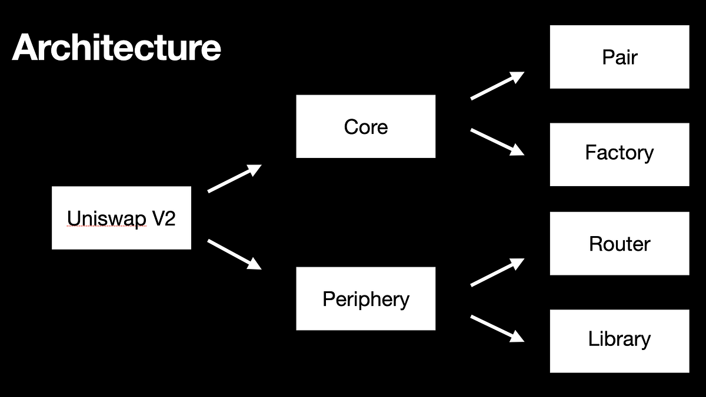

# Day 59 — Uniswap V2 (DeFi Auditing Fundamentals)

**Course:** Cyfrin — Uniswap V2  
**Goal:** Take DeFi auditing skills to the next level  
**Status:** Course intro + AMM math + contract architecture (theory).

---

## 1) Why Uniswap V2 Matters for Auditors
- Uniswap V2 is a **foundational DeFi primitive**
- Many AMMs, DEXs, and forks reuse the same ideas
- Understanding V2 deeply helps with:
  - AMM logic bugs
  - Price manipulation
  - Slippage & MEV issues
  - Liquidity accounting errors
- Extremely common target in **audit contests & bug bounties**

---

## 2) Constant Product AMM — Core Math
Uniswap V2 uses the **constant product formula**:

x * y = L²

Where:
- `x` = reserve of token X
- `y` = reserve of token Y
- `L` = liquidity parameter

All valid pool states lie on this curve.

### Example (Initial State)
- x = 200
- y = 200
- L = 200  
→ x * y = 40,000 = L²

---

## 3) How Swaps Work (Intuition)
- A swap **moves the pool along the curve**
- If a trader adds token Y:
  - y increases
  - x must decrease to keep x*y constant
- The **difference** in reserves = trader output

### Example
Start:
- (x₀, y₀) = (200, 200)

Trader adds 200 Y:
- New y₁ = 400
- New x₁ = 100

Trader receives:
- Δx = 200 − 100 = 100

---

## 4) What Is Liquidity (L)?
- `L` controls how “flat” or “steep” the curve is
- Higher liquidity:
  - Less slippage
  - Better price for the same trade size
- Lower liquidity:
  - More slippage
  - Easier to manipulate prices (⚠️ auditor red flag)

### Liquidity Example
If:
- x = 400
- y = 400
- L = 400

Adding 200 X:
- x₁ = 600
- y₁ ≈ 266.67
- Δy ≈ 133.33

→ Higher L = better trade outcome.

---

## 5) Uniswap V2 Contract Architecture

### Factory
- Deploys **Pair** contracts
- One Pair per token pair (ETH/DAI, DAI/MKR, etc.)
- Enforces uniqueness of pairs

### Pair
- Holds reserves (x, y)
- Executes swaps
- Mints/burns LP tokens
- Core invariant: `reserve0 * reserve1 = constant`

### Router
- User-friendly entry point
- Handles:
  - Add / remove liquidity
  - Single-hop swaps
  - Multi-hop swaps (ETH → DAI → MKR)
- Reduces user error

### User Interaction Flow
- User → Router → Pair(s)
- User → Factory (optional, for pair creation)

---

## 6) Auditing Mindset for Uniswap V2
When auditing AMMs like Uniswap V2, always ask:

- Is the **constant product invariant** preserved?
- Can reserves be manipulated mid-transaction?
- Are fees applied correctly?
- Are there rounding / precision issues?
- Can liquidity be drained via edge cases?
- Is price manipulable via low liquidity?

---

## 7) Common Bug Classes in AMMs (Preview)
- Price manipulation via flash loans
- Incorrect reserve updates
- Fee miscalculation
- Slippage misestimation
- Reentrancy around token transfers
- Precision loss & rounding errors
- TWAP / oracle misuse (when integrated)

---

## 8) How to Learn This Section Effectively
- Don’t memorize formulas — **understand movement on the curve**
- Recreate swaps visually (Desmos helps a lot)
- Use Foundry + mainnet fork
- Simulate swaps, liquidity changes, edge cases
- Take notes and push to GitHub (this repo)

---

**Key takeaway:**  
> Uniswap V2 is not “just math” — it’s economic logic encoded in Solidity.  
Understanding it deeply is mandatory for serious DeFi auditors.
